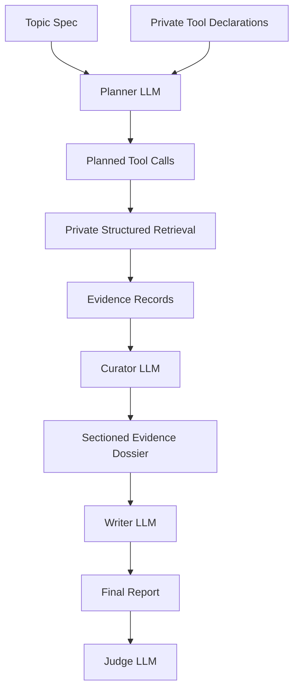

# Prompt Walkthrough: Marvell / Broadcom

This walkthrough shows the prompt structure used for one benchmark topic:

> Should Marvell Technology be valued as a standalone AI infrastructure
> compounder or as a strategic acquisition candidate for Broadcom?

The examples are intentionally public-facing. They preserve the agent roles and
decision flow, but omit private retrieval APIs, internal identifiers, endpoint
details, and backend-specific tool schemas.

## Topic Spec

```yaml
slug: marvell-broadcom
archetype: strategic_alternatives
question: Should Marvell Technology be valued as a standalone AI infrastructure compounder or as a strategic acquisition candidate for Broadcom?
roles:
  target: Marvell Technology
  buyer: Broadcom
seed_entities:
  - Marvell Technology
  - Broadcom
```

The `strategic_alternatives` archetype requires these sections:

1. Situation Overview
2. Target Standalone Case
3. Strategic Buyer Case
4. Deal Feasibility
5. Valuation
6. Alternative Paths

## Yottagraph Agent Prompts

The Yottagraph pipeline is split into three LLM roles plus a judge:



### 1. Retrieval Planner

The planner receives the topic, required outline, and a private block of tool
declarations. Its job is to choose retrieval calls, not write the report. The
public supplement does not include concrete tool names, argument schemas, or
backend endpoints; those are represented by the placeholder below.

```text
You are planning evidence retrieval for an investment research report.

Topic:
Should Marvell Technology be valued as a standalone AI infrastructure
compounder or as a strategic acquisition candidate for Broadcom?

Required report sections:
1. Situation Overview
2. Target Standalone Case
3. Strategic Buyer Case
4. Deal Feasibility
5. Valuation
6. Alternative Paths

Available retrieval tools:
<private tool declarations injected here>

Each declaration normally includes:
- tool name
- short docstring
- argument schema
- constraints on when to use the tool
- citation/provenance guarantees for returned evidence

Use the tool declarations above to produce a high-recall retrieval plan.
Do not write the report.

Return only JSON in the private call format expected by the retrieval adapter.
```

In the private pipeline, the retrieval adapter executes the planned calls after
the planner returns them. The public supplement intentionally omits that call
schema and execution layer due to IP concerns.

### 2. Evidence Curator

The curator receives retrieved evidence records and turns them into a compact
section-by-section dossier. It does not write investment prose.
The public supplement includes a small sanitized example at
[`evidence-dossiers/marvell-broadcom.md`](evidence-dossiers/marvell-broadcom.md).

```text
Create a concise evidence dossier organized by the required report headings.

Rules:
- Use each required heading exactly once.
- Select only evidence records that directly support that section.
- Prefer source-backed facts over unsupported background.
- Preserve citation labels supplied with each evidence record.
- Include enough evidence for each section to support a decision-grade report.
- Do not write the final report.
```

The intended output shape is:

```markdown
## Situation Overview
Why this evidence matters: ...
- [1] Marvell has ...
- [2] Broadcom has ...

## Target Standalone Case
Why this evidence matters: ...
- [3] Marvell reported ...
- [4] Marvell's product portfolio includes ...

## Strategic Buyer Case
Why this evidence matters: ...
- [5] Broadcom reported ...
- [6] Broadcom's AI infrastructure exposure includes ...
```

### 3. Report Writer

The writer receives the topic outline and curated evidence dossier. Its job is
to produce the final report from supplied evidence only.

```text
You are a senior investment banking analyst. Write a comprehensive research
report using only the supplied evidence dossier. Every material claim must be
cited using the citation labels in the dossier. Label unsupported claims
[DATA GAP].

Attached topic outline:
# Should Marvell Technology be valued as a standalone AI infrastructure
compounder or as a strategic acquisition candidate for Broadcom?

## Required Entities
- Target: Marvell Technology
- Buyer: Broadcom

## Required Sections
### 1. Situation Overview
- Gather evidence relevant to situation overview.
### 2. Target Standalone Case
- Gather evidence relevant to target standalone case.
### 3. Strategic Buyer Case
- Gather evidence relevant to strategic buyer case.
### 4. Deal Feasibility
- Gather evidence relevant to deal feasibility.
### 5. Valuation
- Gather evidence relevant to valuation.
### 6. Alternative Paths
- Gather evidence relevant to alternative paths.

Evidence dossier:
<sectioned evidence dossier goes here>

Format requirements:
1. Include 3-5 tables appropriate to the topic. Each table row should cite
   sources.
2. Outside tables, each bullet should state one material fact and end with its
   citation.
3. Do not group multiple unrelated facts into one bullet or end a paragraph
   with a single citation.
4. Label unsupported claims [DATA GAP].
5. Each required section must contain at least 2 substantive paragraphs or 5+
   cited bullets.
6. Use the exact required headings.
```

## Deep Research Prompt

The Deep Research baseline is a black-box research agent. It receives the topic
and required structure, then performs its own research and synthesis.

```text
Use the attached topic outline to produce a comprehensive investment research
report.

The topic is:
Should Marvell Technology be valued as a standalone AI infrastructure
compounder or as a strategic acquisition candidate for Broadcom?

Attached topic outline:
<same outline as above>

Write a comprehensive, deeply analytical investment banking strategic
alternatives report. This is a full research document, not a summary.

Use every required heading and make each section substantive. Cite every
material claim inline with its source URL.
```

## No-Context Prompt

The no-context baseline intentionally removes retrieval and search. It gives the
model only the topic, outline, and report instructions.

```text
Use the attached topic outline to produce a comprehensive investment research
report.

The topic is:
Should Marvell Technology be valued as a standalone AI infrastructure
compounder or as a strategic acquisition candidate for Broadcom?

Attached topic outline:
<same outline as above>

Write a comprehensive, deeply analytical investment banking strategic
alternatives report.

No additional context, retrieval output, or source evidence has been provided.
Do not use tools. Write the best report you can from the model's own knowledge
only. If a factual claim is not supported by a provided source, mark it
[UNCITED].
```

## Judge Prompt

The judge receives only the final report and the topic-specific rubric. It
scores the report on six dimensions using a 1-10 scale.

```text
You are a senior research quality reviewer evaluating an investment banking
strategic alternatives report on the question:

"Should Marvell Technology be valued as a standalone AI infrastructure
compounder or as a strategic acquisition candidate for Broadcom?"

Score the report on six dimensions:

1. financial_grounding
   Does the report use specific cited financial figures from evidence?

2. target_specificity
   Does the report provide concrete evidence for Marvell's standalone case?

3. buyer_logic
   Does the report provide evidence-backed strategic buyer rationale?

4. deal_feasibility
   Does the report assess regulatory, financing, and execution realism?

5. analytical_coherence
   Do comparisons and conclusions follow from evidence?

6. citation_coverage
   Do material claims have inline citations?

Return only valid JSON:
{
  "financial_grounding": N,
  "target_specificity": N,
  "buyer_logic": N,
  "deal_feasibility": N,
  "analytical_coherence": N,
  "citation_coverage": N,
  "overall_verdict": "pass" | "fail",
  "reason": "<one sentence summary>"
}
```

Pass threshold: mean score at least 9 and no individual score below 8.

